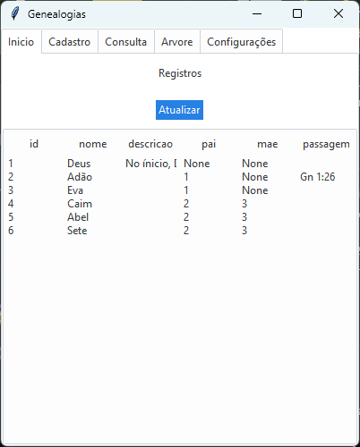
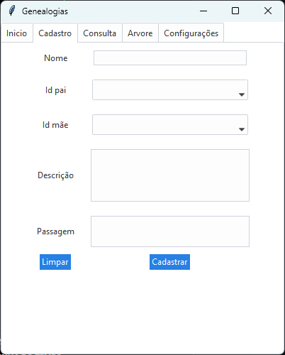
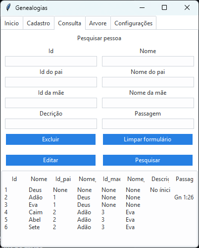
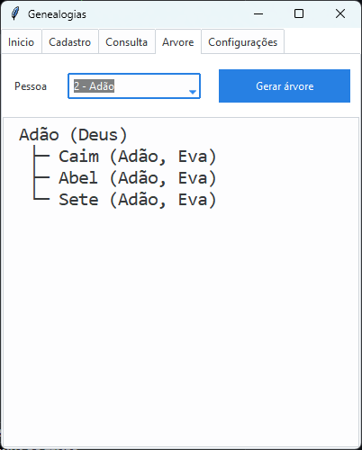

# 🌳 Sistema de Genealogia (MVC com Tkinter)

Um sistema desktop para gerenciamento e visualização de relações familiares, desenvolvido em Python com arquitetura MVC e interface gráfica em Tkinter + ttkbootstrap.

O projeto permite cadastrar pessoas, relacionar pais e mães, pesquisar registros dinamicamente, edita-los e visualizar uma árvore genealógica recursiva.

---

## 📸 Demonstração

### Tela inicial



### Cadastro de pessoas



### Consulta com filtros



### Árvore genealógica



---

## ⚙️ Funcionalidades

* 📌 Cadastro de pessoas com nome, descrição e passagem
* 👨‍👩‍👧 Relacionamento de pais e mães (FK no SQLite)
* 🔎 Sistema de busca com múltiplos filtros dinâmicos
* ✏️ Edição de registros via janela modal
* 🗑️ Exclusão de registros com confirmação
* 🌳 Geração de árvore genealógica recursiva
* 🎨 Interface com temas claros e escuros (ttkbootstrap)
* 💾 Persistência de dados com SQLite

---

## 🧠 Arquitetura

O projeto segue o padrão **MVC (Model-View-Controller)**:

```
Model → responsável pelo banco de dados (SQLite)
View → interface gráfica (Tkinter + ttkbootstrap)
Controller → lógica de interação entre View e Model
```

Além disso, há um módulo específico para geração de árvore genealógica com recursão.

---

## 🛠️ Tecnologias utilizadas

* Python 3.x
* Tkinter
* ttkbootstrap
* SQLite3

---

## 🌳 Algoritmo de Árvore Genealógica

A árvore é construída de forma recursiva, percorrendo relações de pai e mãe no banco de dados e evitando loops com controle de visitas.

Exemplo de saída:

```
João
├─ Maria
│   ├─ Pedro
│   └─ Ana
└─ Carlos
```
---

## 👨‍💻 Autor

Desenvolvido por **Guilherme Carpi**
Projeto para portfólio de desenvolvimento.

---

## 🧩 Observação

Este projeto foi desenvolvido com foco em aprendizado de:

* arquitetura MVC
* manipulação de banco de dados relacional
* interfaces gráficas em Python
* algoritmos recursivos (árvore genealógica)
